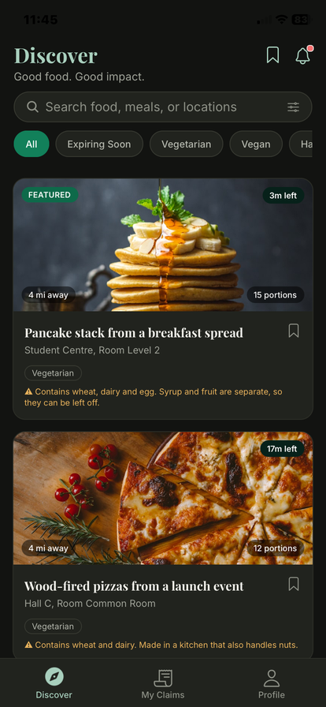
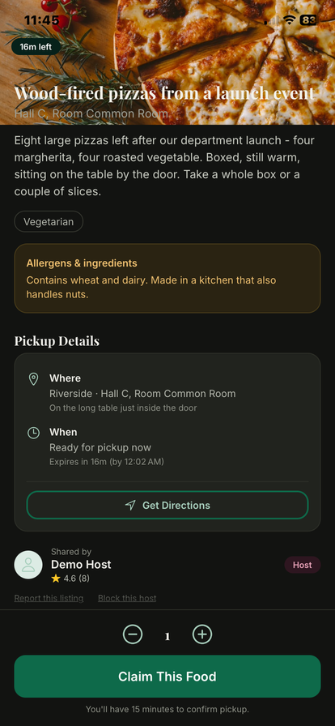
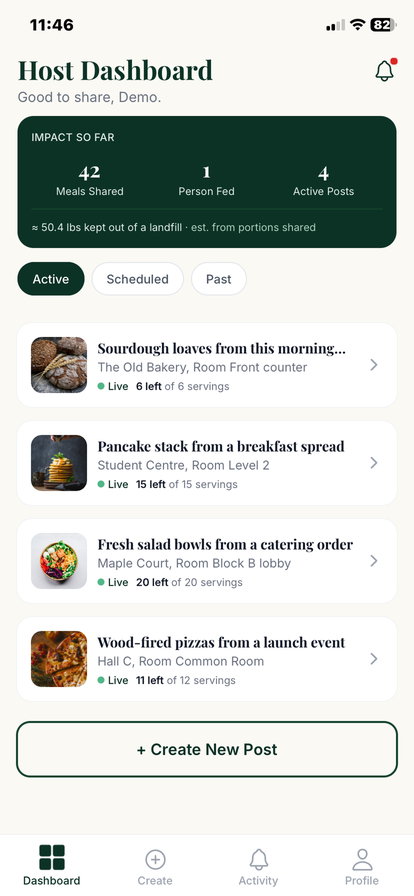
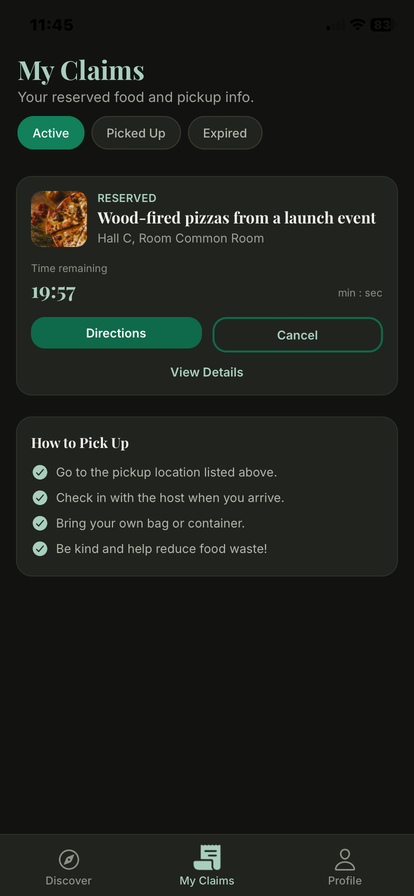
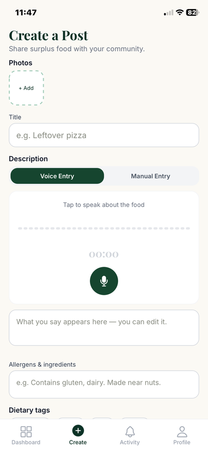

# EcoEats

**Food rescue for the people around you.** Organizers post surplus
food with a photo, a pickup location and a countdown; recipients browse a live
feed, claim a portion, and walk over before it expires.

[](https://github.com/saarvesh0606/ecoeats/actions/workflows/ci.yml)

iOS, v0.2.0 — passed App Review on 2026-09-10. The privacy policy and support
pages live at [ecoeats-web.onrender.com](https://ecoeats-web.onrender.com).

<p align="center">
  
  
  
  
  
</p>

Every event on a campus ends the same way: trays of untouched food, a room being
packed up, and no way to tell anyone within the twenty minutes it stays good.
EcoEats is that missing twenty-minute channel — a listing lives for at most an
hour by design, because food that has been sitting out longer is not food anyone
should be sent to collect.

This repository is the whole product: the FastAPI backend, the React Native
client, the migrations, both test suites, the deploy configuration and the
generated legal site. It is **source-available, not open source** — see
[Licence and ownership](#licence-and-ownership) — and it is published so the
work can be read, not so it can be redeployed.

---

## Tech stack

**Backend**

| Layer | Choice |
| --- | --- |
| Language | Python 3.12 (3.11+ supported) |
| Framework | FastAPI — async end to end |
| Data | SQLAlchemy 2.0 async + Alembic, PostgreSQL 16 |
| Redis | Rate limiting and the SSE event bus |
| Auth | Firebase Auth — email, Sign in with Apple, Google — verified via the Admin SDK |
| Images | Cloudinary, signed direct-to-CDN upload |
| Push | Expo Push (fronts APNs and FCM) |
| Errors | Sentry, with URL credential scrubbing |
| Packaging | Docker, hash-pinned dependency lock |

**Client**

| Layer | Choice |
| --- | --- |
| Framework | React Native 0.83 on Expo SDK 55 |
| Routing | expo-router (file-based) |
| Styling | NativeWind (Tailwind), light and dark |
| Animation | Reanimated 4 + worklets |
| Realtime | SSE — `react-native-sse` on native, `EventSource` on web |
| Native | camera roll, location, haptics, notifications, speech recognition |
| Delivery | expo-updates — JavaScript ships over the air, no rebuild |
| Tooling | TypeScript, Biome, Jest + Testing Library |

**Infrastructure** — Render (API, Docker, auto-deploy from `main`), Neon
(Postgres), Upstash (Redis), EAS (iOS builds and OTA updates).

---

## What it does

**Signing in** — email and password, Sign in with Apple, or Google. Apple's
*Hide My Email* works as-is because the API accepts any verified address. An
account made one way can link Apple from Settings, so the same person does not
end up with two accounts; for the pairs that already exist, `POST
/users/me/merge` folds one into the other.

**Posting** — photo, title, description, allergens, portion count, dietary tags,
and a pickup location pinned on a map. The description can be dictated instead
of typed. Expiry is a fixed choice of 15/20/30/45/60 minutes, and posts can be
scheduled ahead rather than published immediately.

**Browsing** — a live feed sorted by urgency, with search, dietary-preference
matching that says *which* preference a card matched, and bookmarking. Quantity
changes arrive over SSE rather than by polling, so a portion disappearing is
visible without a refresh.

**Claiming** — reserve a portion and get a countdown and directions. The host
confirms pickup or marks a no-show; either side can cancel, and a cancelled
claim returns its portions to the pool. Double-claiming is rejected at the
database level, not hopefully in application code.

**After** — recipients rate the host; hosts see cumulative impact in portions
and pounds diverted, computed from completed pickups rather than from posts
created.

**Report and block** — any listing can be reported and any user blocked. A block
is symmetric: their listings leave your feed and yours leave theirs, and neither
can claim from the other. Reports land in a queue that `scripts/list_reports.py`
reads and closes, which is what makes the 24-hour moderation promise true.

**Account** — forgot-password by email, and deletion from Settings that removes
the row, the Firebase identity and the Sign in with Apple authorisation
together, so signing up again later gets a full account rather than a nameless
one.

**Throughout** — an in-app activity feed with unread state, push notifications
that deep-link to the right screen from a locked phone, role switching between
organizer and recipient, per-role terms acceptance, dark mode, and an offline
notice that blames the network instead of the food.

A background sweeper releases lapsed reservations and retires finished listings,
so nothing depends on a client being open to stay correct.

---

## Security

The API assumes every request is hostile until the token says otherwise.

**Authentication.** Firebase ID tokens are verified with the Admin SDK, and
revocation is checked on every request — signing out genuinely ends a session
rather than leaving a stolen token valid until it expires on its own. (The
account record behind that check is cached for a minute; asking Google inline on
every request made a network round trip, not the CPU, the throughput ceiling.)
The rules are enforced in a single dependency that runs before any handler, so
no route can forget one: the address must be **verified**, always, and it must
sit on **`ALLOWED_EMAIL_DOMAIN`** if the deployment sets one. That setting ships
unset — any verified address is accepted — because Apple sign-in issues
`@privaterelay.appleid.com` addresses and Google accounts arrive on whatever
domain their owner has.

**Identity is never taken from a request body.** The registration schema has no
`email` or `id` field at all. It is read from the verified token or not at all.

**Authorization is per-object.** Every ownership-sensitive action — editing or
cancelling a listing, confirming pickup, marking a no-show, rating, viewing a
listing's claims — checks the actor against the row. There is no endpoint where
knowing an ID is enough to act on it.

**The development auth bypass cannot reach production.** `DEV_AUTH_BYPASS`
accepts stand-in tokens so the client can be built before real accounts
exist. If it is ever true while `APP_ENV=production`, **the application refuses
to start** — a boot failure rather than a service quietly accepting forged
identities. A test pins that behaviour.

**Supply chain.** The image installs from `requirements.lock` with
`--require-hashes`: every wheel is checked against a recorded digest, so a
substituted package fails the build instead of shipping. Tests fail if a
dependency is added without re-locking.

**Also enforced** — per-user rate limits keyed on the account rather than the IP
(campus NAT makes IP limits meaningless), an exact-match CORS allowlist,
hardening headers with production-only HSTS, generic 500s that never leak
internals, deliberately opaque token-rejection reasons, API docs disabled in
production, and Sentry configured with `send_default_pii=False` **plus** a
scrubber for credentials in URLs, which that flag does not cover.

Secrets never enter the repository: the entire `secrets/` directory is ignored,
with name-pattern rules behind it. Cloudinary's signing secret stays server-side
— the client receives a short-lived signed ticket and uploads directly.

---

## Layout

```text
ecoeats/
│
├── api/                        FastAPI backend
│   ├── main.py                 app factory, middleware order, health endpoints
│   ├── config.py               settings validated at boot — no silent fallbacks
│   ├── db.py                   async engine, session dependency, declarative base
│   ├── deps.py                 auth rules, sessions, per-user rate limits
│   ├── errors.py               typed errors to HTTP status, one handler
│   ├── events.py               Redis pub/sub behind the SSE stream
│   ├── middleware.py           request context, security headers, access log
│   ├── monitoring.py           Sentry init + URL credential scrubbing
│   ├── ratelimit.py            Redis limiter, in-memory fallback for dev
│   ├── logging_config.py       structured JSON logs in production
│   ├── pagination.py           keyset cursors — stable as rows expire mid-scroll
│   ├── geo.py                  distance maths for the radius filter
│   ├── legal.py                terms version, per-role acceptance
│   │
│   ├── auth/
│   │   ├── tokens.py           TokenVerifier protocol + VerifiedIdentity
│   │   ├── firebase.py         real verification, check_revoked=True
│   │   └── dev.py              dev:<slug> bypass — cannot start in production
│   │
│   ├── models/                 SQLAlchemy tables + constraints
│   │   ├── user.py             lowercase email — the domain rule is a setting
│   │   ├── listing.py          quantity and expiry constraints
│   │   ├── claim.py            uq_claim_per_recipient — double-claim guard
│   │   ├── moderation.py       blocks (uq_block_pair) and reports
│   │   ├── rating.py           saved.py  device.py  notification.py
│   │   └── enums.py            types.py
│   │
│   ├── schemas/                Pydantic request/response shapes
│   │   ├── user.py             RegisterProfile — deliberately no email or id
│   │   ├── listing.py          claim.py  rating.py  moderation.py
│   │   └── notification.py     device.py
│   │
│   ├── routers/                HTTP surface only — no business logic
│   │   ├── listings.py         feed, search, saved, impact, SSE stream
│   │   ├── claims.py           claim, pickup, no-show, cancel, rate
│   │   ├── users.py            profile, role, terms, Apple link, merge, delete
│   │   ├── moderation.py       report a listing, block / unblock, list blocks
│   │   ├── notifications.py    devices.py  uploads.py
│   │   └── ...
│   │
│   └── services/               the actual behaviour
│       ├── listings.py         claims.py — ownership and inventory rules
│       ├── moderation.py       block symmetry, report queue
│       ├── merge.py            fold two accounts into one — destructive
│       ├── apple.py            revoke Apple authorisation on delete (5.1.1(v))
│       ├── notify.py           push.py — fan-out and Expo delivery
│       ├── scheduler.py        sweeper: release lapsed, retire expired
│       └── uploads.py          Cloudinary signing, secret never leaves here
│
├── mobile/                     Expo / React Native client
│   ├── app/                    expo-router — the file tree IS the navigation
│   │   ├── (auth)/             login, register, forgot-password, verify-email,
│   │   │                       role, terms, connection-problem
│   │   └── (app)/
│   │       ├── (tabs)/         feed, post, posts, claims, activity, profile
│   │       ├── listing/[id]    detail + claim
│   │       ├── manage/[id]     host view of one listing
│   │       ├── notifications   saved
│   │       └── settings/       index, blocked, [doc] legal pages
│   │
│   ├── src/
│   │   ├── screens/            screen implementations behind the routes
│   │   ├── components/         shared UI, components/ui primitives
│   │   ├── context/            AuthContext, UnreadContext
│   │   ├── hooks/              location, speech, audio levels, push nav
│   │   └── lib/                api, firebase, appleAuth, listingStream,
│   │                           moderation, legal (the terms — one source),
│   │                           validation, push, uploads, session, preferences
│   ├── scripts/
│   │   └── build-legal-site.mjs  legal.ts → web/
│   └── app.json                native config, plugins, bundle id
│
├── web/                        GENERATED public site: support + the three legal
│                               documents. Never hand-edit — rebuild from legal.ts
├── docs/screenshots/           the App Store screenshots, at a third size
│
├── migrations/                 Alembic revisions
├── tests/                      backend suite — hard-fails without a database
├── scripts/
│   ├── dev_account.py          Firebase accounts without inbox access
│   ├── list_reports.py         the moderation queue — read it, close entries
│   ├── merge_accounts.py       preview by default, --apply to fold accounts
│   ├── orphaned_profiles.py    rows whose Firebase identity is gone
│   ├── start.sh                migrate, then exec uvicorn
│   └── ci_fake_firebase.py     throwaway service account for CI
│
├── flutter_app/                parked prototype — not part of the product
├── Dockerfile                  hash-pinned install, non-root user
├── requirements.lock           58 packages, digest-verified
├── render.yaml                 Render blueprint: API (Starter) + static site
├── DEPLOY.md                   the long-form deploy runbook
├── SECURITY.md                 how to report a vulnerability privately
└── docker-compose.yml          local Postgres + Redis
```

There is deliberately no module-level `app = create_app()`. Building the app at
import time would make the module unimportable without a full environment, so
Uvicorn is pointed at the factory with `--factory`.

---

## Running it

Requires Python 3.11+, Node 20+ and Docker. The backend runs end to end with
nothing but this repository; the client additionally needs a Firebase project
of your own (free tier is enough) because sign-in is Firebase's.

**Backend**

```bash
docker compose up -d db redis
```

```bash
python -m venv .venv
```

```bash
source .venv/bin/activate        # Windows: .venv\Scripts\activate
```

```bash
pip install -e ".[dev]"
```

```bash
cp .env.example .env
```

```bash
uvicorn api.main:create_app --factory --reload
```

| Endpoint | URL |
| --- | --- |
| API | http://localhost:8000 |
| Docs (development only) | http://localhost:8000/docs |
| Liveness | http://localhost:8000/health |
| Readiness — checks Postgres | http://localhost:8000/health/ready |
| Build identity | http://localhost:8000/health/version |

Business endpoints are versioned under `/api/v1`, so a future `/api/v2` can
change shapes without breaking builds already on people's phones. Health and
docs stay unversioned — orchestrators depend on those paths being stable.

**Firebase.** The backend starts without it in development — authentication is
simply off, which is what lets the test suite run against a fake token issuer.
To verify real sign-ins it needs a service-account key at
`secrets/firebase-service-account.json` plus `FIREBASE_PROJECT_ID` and
`FIREBASE_CREDENTIALS_PATH` in `.env`. In production, missing Firebase config
is a startup failure, not a degraded mode.

**Client**

```bash
cd mobile && npm install --legacy-peer-deps && cp .env.example .env
```

Fill `mobile/.env` with your Firebase project's **web** config (Project settings
→ General → Your apps). Those `EXPO_PUBLIC_*` values are bundled into the app
and are not secrets — but `config.ts` refuses to start without them, so an
empty `.env` fails at launch with a message saying which one is missing. The
API URL defaults to `http://localhost:8000`; a physical phone needs your
machine's LAN address instead.

```bash
npm run web
```

For a full local loop without Firebase verification, set `DEV_AUTH_BYPASS=true`
on the backend and `EXPO_PUBLIC_DEV_AUTH=true` on the client: the login screen
gains a one-tap dev sign-in, and the API accepts `dev:<slug>` tokens. The
backend refuses to boot with that flag in production.

`scripts/dev_account.py` handles Firebase accounts without inbox access — mint a
verification link without sending mail, mark an address verified, free an
address for re-signup, or send a real verification email to measure
deliverability.

---

## Tests

```bash
pytest
```

```bash
cd mobile && npm test
```

345 backend tests and 446 client tests. CI runs both on every push, plus `ruff`
and `biome`.

Tests run against a **real PostgreSQL database** — `ecoeats_test`, created
automatically alongside the dev database on first container start.

**A missing database fails the run. It does not skip.** An earlier version of
this project skipped roughly 3,500 lines of route tests whenever no database was
configured, so CI reported green while testing nothing at all. `conftest.py` now
calls `pytest.exit()` with a non-zero code and says how to fix it.

---

## Deploying

Pushing to `main` redeploys the API — `render.yaml` has `autoDeploy: true` with
no path filter, so even a client-only change restarts it. Migrations run at
container start.

Confirm a deploy landed without opening a dashboard:

```bash
curl https://ecoeats-api.onrender.com/health/version
```

`revision` compares directly against `git rev-parse HEAD`. This exists because
`/health` answers identically before a swap, after it, and when a build failed
and the previous container kept serving.

Client JavaScript ships **over the air** — no rebuild, no App Store round trip.
There are two channels and an update only reaches the one it is sent to: the
App Store build is on `production`, TestFlight builds are on `preview`.

```bash
cd mobile && npx eas-cli update --branch production --environment production -m "message"
```

```bash
cd mobile && npx eas-cli update --branch preview --environment preview -m "message"
```

Two force-quits to apply: the first launch downloads, the second runs it.
Settings → About reports the running update and channel. A native rebuild is
only needed when a native module is added — and a new *capability* (Sign in
with Apple was one) also needs the provisioning profile regenerated by hand via
`eas credentials`, because `eas build` validates the certificate and nothing
else.

The public site is a Render static site served from `web/`. It has no build
step on Render because the pages are generated locally and committed:

```bash
cd mobile && npm run build:legal
```

Run that whenever `mobile/src/lib/legal.ts` changes, in the same commit as the
`TERMS_VERSION` bump, so the app and the website never disagree about what
people accepted.

---

## Conventions worth knowing

- Settings are validated at startup. Missing required config is a boot failure,
  never a runtime surprise.
- Route handlers never manage transactions — the session dependency commits on
  success and rolls back on any exception.
- Expected failures raise an `AppError` subclass; anything else becomes a logged
  500 with no internal detail returned.
- Business logic lives in `services/`, not in route handlers.
- Concurrency correctness lives in the database. Double-claim protection is a
  constraint, not a check-then-act.

---

## Known limitations

- **Session tokens live in AsyncStorage**, unencrypted at rest. Protected by the
  iOS app sandbox and standard for Firebase on React Native, but a hardening
  target.
- **`flutter_app/`** is a parked prototype on mock data with no backend
  integration. It is not part of the product and is not built or shipped.

---

## Bugs, security and contributions

**Found a bug?** Open an [issue](https://github.com/saarvesh0606/ecoeats/issues)
with the build number from Settings → About and what you expected to happen.

**Found a security problem?** Please don't file it publicly — this code runs a
live service with real people's accounts behind it. Email
**hello@ecoeatsapp.com** instead; see [SECURITY.md](SECURITY.md) for what to
include and what to expect back.

**Pull requests** are not accepted without prior discussion, because the
licence below means a contribution can't be merged on the usual open-source
terms. Open an issue first if you have something in mind.

---

## Contributors

- [@saarvesh0606](https://github.com/saarvesh0606) — creator and maintainer
- [@nishantdesai922](https://github.com/nishantdesai922)

---

## Licence and ownership

Copyright © 2026 Sarvesh Sunil Jagtap. All rights reserved. See [LICENSE](LICENSE).

This is proprietary source, published so it can be read. Reading it grants no
right to use, copy, modify or deploy it — ask first. GitHub shows no licence
badge on this repository for exactly that reason: there is no open-source
licence to show.

Two things the licence deliberately does not cover:

- **No university's marks are licensed by it.** EcoEats carries no university
  branding today — it was removed pending permission — and nothing here grants
  a right to any institution's name, wordmark or logo.
- **Dependencies keep their own licences**, as do photographs loaded from
  third-party services at runtime.

Changing the terms later means editing `LICENSE` and nothing else: both
`pyproject.toml` and `mobile/package.json` point at the file rather than naming
the licence, so they stay correct on their own.
